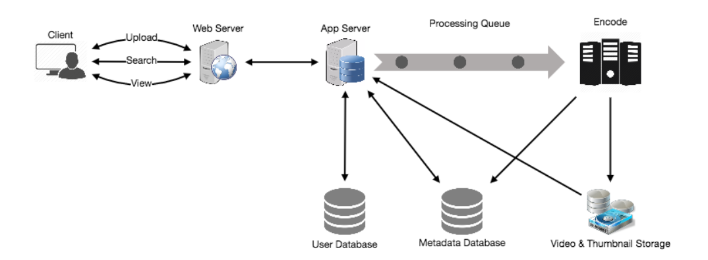

# 1. Design Youtube

## 1.1. Requirements

### 1.1.1. Functional requirements
1. Users should be able to upload videos.
2. Users should be able to share and view videos.
3. Users should be able to perform searches based on video titles.
4. Our services should be able to record stats of videos, e.g., likes/dislikes, total number of views,
etc.
5. Users should be able to add and view comments on videos.
### 1.1.2. Non-functional requirements
1. The system should be highly reliable, any video uploaded should not be lost.
2. The system should be highly available. Consistency can take a hit (in the interest of
availability); if a user doesn’t see a video for a while, it should be fine.
3. Users should have a real time experience while watching videos and should not feel any lag.

## 1.2. Capacity estimation and constraints

- **Total users:** 1.5 billion, with 800 million daily active users.
- **Daily video views:** Estimated at 46,000 videos per second based on an average of 5 views per user per day.
- Upload:view ratio: Assumed to be 1:200, resulting in 230 videos uploaded per second.
- **Storage needs:** With 500 hours of video uploaded per minute, and assuming 50MB of storage per minute of video, the storage requirement amounts to 1500 GB/min (25 GB/sec).
- **Bandwidth requirements:** Anticipated outgoing bandwidth of 1TB/s considering 300GB of uploads every minute and a 1:200 upload:view ratio.

## 1.3. System APIs
**uploadVideo**(api_dev_key, video_title, vide_description, tags[], category_id,default_language,recording_details, video_contents)
- returns HTTP 202 (request accepted) 

**searchVideo**(api_dev_key, search_query, user_location, maximum_videos_to_return,page_token)
- returns: A JSON containing information about the list of video resources matching the search query. Each video resource will have a video title, a thumbnail, a video creation date, and a view count.

## 1.4. High level design

At a high-level we would need the following components:

1. **Processing Queue:** Each uploaded video will be pushed to a processing queue to be de-queued later for encoding, thumbnail generation, and storage.
2. **Encoder:** To encode each uploaded video into multiple formats.
3. **Thumbnails generator:** To generate a few thumbnails for each video.
4. **Video and Thumbnail storage:** To store video and thumbnail files in some distributed file
storage.
5. **User Database:** To store user’s information, e.g., name, email, address, etc.
6. **Video metadata storage:** A metadata database to store all the information about videos like
title, file path in the system, uploading user, total views, likes, dislikes, etc. It will also be used to store all the video comments.
